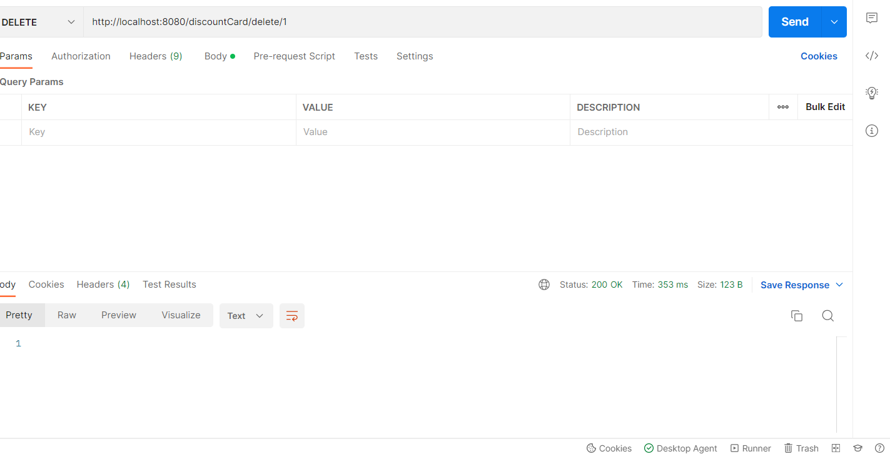
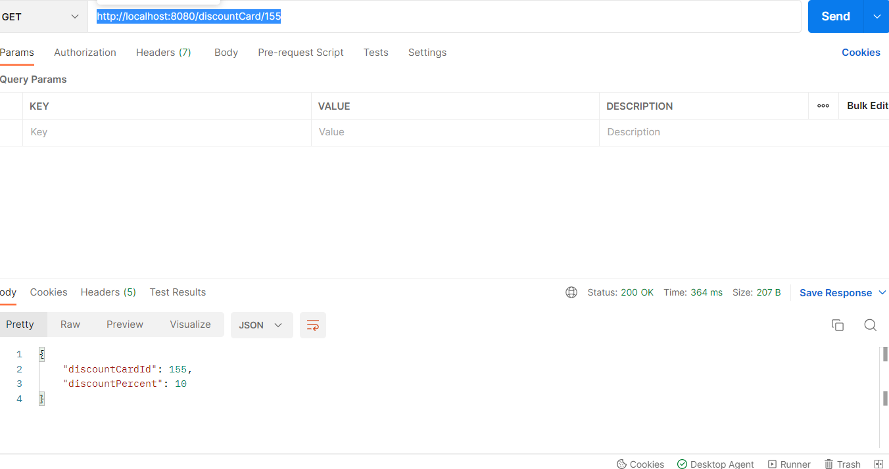
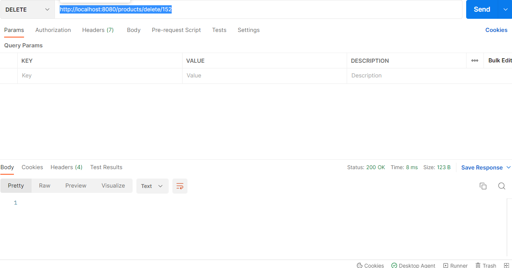
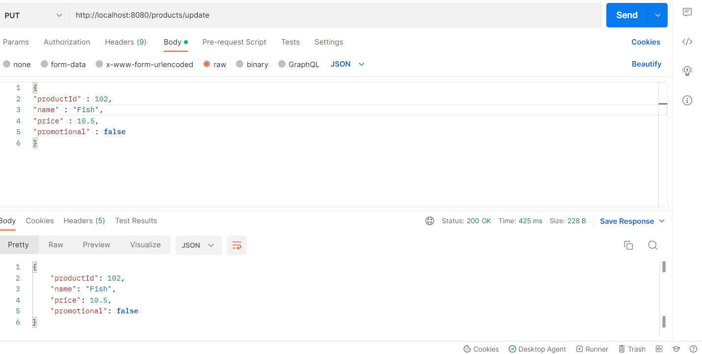
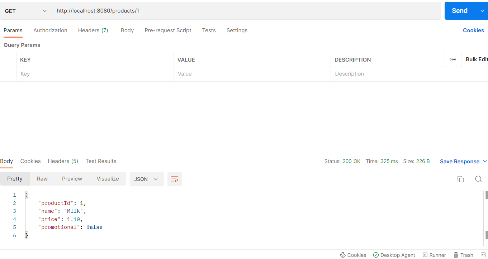

<h1>CashReceipt</h1>
A Project that allows you to build products cash receipt.

<h1 style="margin-top: -20px">Technology stack</h1>
1.Spring Boot
 
2.Spring data jpa
 
3.AspectJ
 
4.Lombok
 
5.Postgresql
 
6.Java 17

<h1 style="margin-top: -20px">Start Instruction</h1>
1. Clone repository from github
 
2. Run project from CashReceiptApplication.java
 
3. Open any browser and in search bar type http://localhost:8080/check?item=1-2&item=4-6&card=1
 
or http://localhost:8080/check?item=1-2&item=4-6

<h1 style="margin-top: -20px">v0.2</h1>
<h5>1.Added implementation of two caches.</h5>
 
* Least Recently Used. Consists of DoublyLinkedList 
that has head node and tail node. New node adds after head node.
When capacity of cache is reached a node before tail node gets removed.
 
 
* Least Frequently Used. Consists of valuesMap that stores all values.
KeyFrequencyMap that stores frequency of keys. FrequencyMap that
stores frequency and keys related to frequency in LinkedHashSet.
 
<h5>2.Added implementation of factory method for Cache. You can 
provide cache algorithm and capacity through application.yml
in resources folder.</h5>

Example:

cache:

capacity: 100

algorithm: LRUCache

<h3>3. Added proxy pattern for repository</h3>

* Save - saves an object to database then saves it to cache.
   
* Delete - deletes an object from database then deletes it from cache
   
* Update - updated an object in database then updates it in cache
   
* FindById - if an object is not present in cache then finds it in database, puts it into cache and returns it.
  <h3>4. Added regex for product name field</h3>
  *Name must start with the capital letter.
 
  *Name must not have any special characters except (")
<h3>Added new end points</h3>
<h5>DiscountCard: </h5>
1.http://localhost:8080/discountCard/update

2. http://localhost:8080/discountCard/delete/1

3. http://localhost:8080/discountCard/add

4. http://localhost:8080/discountCard/155

<h5>Product: </h5>
5. http://localhost:8080/products/save

6. http://localhost:8080/products/delete/152

7. http://localhost:8080/products/update

8. http://localhost:8080/products/1

